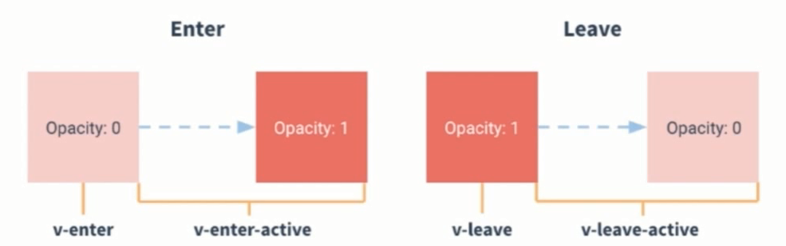

# my-demo

> A Vue.js project

## 过渡动画

#### tansiton过渡标签
> transiton要配合v-show类似的指令，name可以随便定义

	<button @click="btnshow">动画1</button>
	
	<transition name="my-trans1">
      <h1 v-show="show">{{ msg }}</h1>
    </transition>

	data () {
	    return {
	      msg: 'Welcome to Your Vue.js App',
	      show:true,
	    }
	},
    methods:{
	    btnshow(){
	      this.show=!this.show
	    }
	}
#### CSS过渡 

> 图片分为四个阶段分别是进入、离开、进入过程、离开过程四个阶段，通过class来实现动画

	.my-trans1-enter-active, .my-trans1-leave-active{
	  transition: all .5s ease-out;
	}
	.my-trans1-enter{
	  transform: translateX(-500px);
	  transform: scale(1.2);
	  opacity:0;
	}
	.my-trans1-leave-active{
	  transform: translateX(500px);
	   transform: scale(1.2);
	  opacity:0;
	}`

